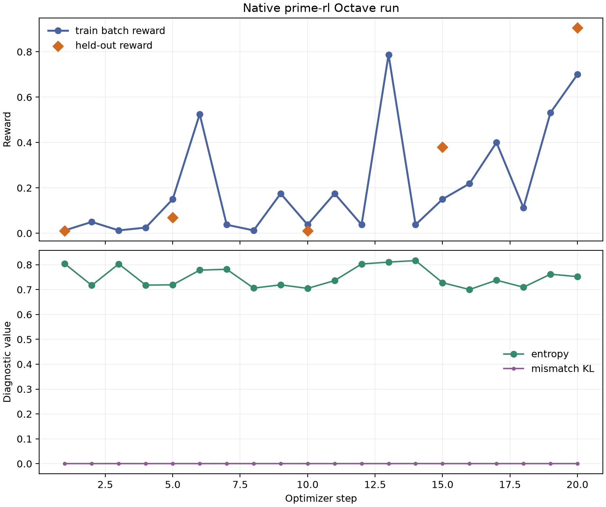
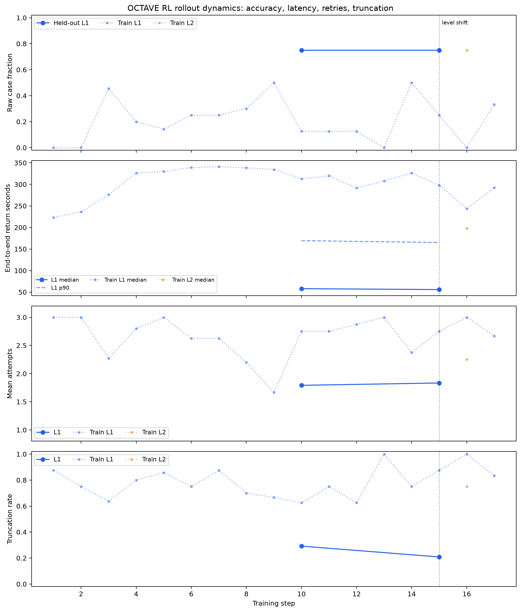

# Octave RL

Octave RL is a reproducible reinforcement-learning environment for teaching
language models to write GNU Octave functions. It uses the native
`verifiers.v1` taskset and harness APIs, generates seeded problems with hidden
NumPy-derived test cases, executes candidate `.m` files against a pinned GNU
Octave 10.2.0 — in an isolated Prime Sandbox or a bounded local subprocess —
and awards deterministic credit for correctness alone.

The repository includes the environment, evaluation and prime-rl
configurations, a staged curriculum controller, tests, analysis scripts, and
compact evidence from completed Qwen3.5-4B experiments. Raw traces,
checkpoints, and model weights are intentionally not committed.

## What is included

- Ten generator families spanning reductions, logical indexing,
  reshape/permutation, broadcasting, sliding windows, linear solves,
  recurrences, structs/cells, string parsing, and signal identities.
- **Eight variants per family** — a named choice of statistic, axis or operator
  that changes what the function must compute, not merely which numbers test it.
  All ten families are converted: **80 variants, 240 distinct prompts** against
  30 before.
- Three difficulty levels with deterministic generation from
  `(level, seed, task index)`.
- Six hidden cases per task and fractional case-level correctness.
- Up to three attempts: an unassisted first answer, diagnostic retry, and an
  optional guide-model hint before the final retry.
- Declining correctness multipliers of `1.00`, `0.85`, and `0.60`, rewarding
  correct answers that require less assistance.
- A confidence-gated curriculum that introduces harder levels only after
  repeated held-out success and can demote after regression.

The environment uses `verifiers.v1` throughout. It does not use the legacy v0
`Environment` contract.

## Results at a glance

> **Every number in this section predates 2026-08-09** and was measured on a
> task pool with three known defects: two families whose natural solution could
> not run, one whose prompt described a different signature, and two level-3
> descriptions that had dropped their task definition. The environment is at
> `0.2.0`; these are `0.1.0` measurements. They are left unrevised because they
> are what was measured. See [PIPELINE_LOG.md](PIPELINE_LOG.md) for what each
> defect did and [OCTAVE_HANDOFF.md](OCTAVE_HANDOFF.md) for what still holds.

Small calibration runs selected `Qwen/Qwen3.5-4B`: it was the first tested
Qwen size with nonzero reward and landed in the desired 10–35% one-turn
baseline range on Levels 1–2. A broader 200-rollout evaluation produced:

| Level | Rollouts | Mean raw correctness | Fully solved |
| --- | ---: | ---: | ---: |
| 1 | 100 | 28.17% | 26 |
| 2 | 100 | 7.00% | 7 |
| Combined | 200 | 17.58% | 33 |

A native 20-step LoRA run on two RTX 6000 Ada GPUs completed all 160 training
rollouts without rollout errors. Held-out Level 1 reward rose from `0.010` at
startup to `0.905` at step 20. These are proof-of-learning results from small
held-out samples, not confidence-bounded benchmark claims.



The staged follow-on confirmed its first promotion gate twice at `0.75` raw
correctness over separate 24-task Level 1 checkpoints, then automatically
shifted from 100% Level 1 to an 80% Level 1 / 20% Level 2 mix.



See [REPORT.md](REPORT.md) for the full experiment analysis and
[OCTAVE_HANDOFF.md](OCTAVE_HANDOFF.md) for current limitations and next steps.

## Requirements

For local development and generation tests:

- Python 3.11–3.13
- [`uv`](https://docs.astral.sh/uv/)

For live evaluation:

- an authenticated [Prime Intellect](https://www.primeintellect.ai/) account
  with Prime Sandbox access;
- the `prime` CLI (`prime login`) or a runtime-injected `PRIME_API_KEY`;
- access to the configured inference models.

For native training, budget for two NVIDIA GPUs: one trainer GPU and one
inference GPU. The validated run used 2× RTX 6000 Ada 48 GB. Hardware pricing
and availability vary, so inspect current capacity before provisioning.

## Install and test

```bash
git clone git@github.com:kaiser-factorial/octave-RL.git
cd octave-RL
uv sync --dev
uv run pytest -q
```

The environment is also a standalone installable package:

```bash
uv pip install -e environments/octave_rl
```

Its public factory is:

```python
from octave_rl import load_environment

taskset = load_environment(
    level=1,
    num_tasks=500,
    max_turns=3,
    require_vectorized=False,
    seed=314159,
)
```

`max_turns` controls the environment's attempt budget; the evaluation or
training harness should use the same or a larger turn cap.

## Evaluate the base model

Log in to Prime, then run a supplied evaluation config:

```bash
prime login
uv run eval @ configs/eval/octave-qwen-4b-two-turn.toml
uv run eval @ configs/eval/octave-qwen-4b-guided-three-turn.toml
```

The third-turn guide defaults to `Qwen/Qwen3.5-35B-A3B` through Prime
Inference. It receives only the public prompt, candidate source, and first
diagnostic—not hidden inputs, expected values, or reference code. Disable the
guide in task configuration if you want a fully self-contained two-turn run.

**The guide needs its credential on disk, not in the environment.** The user
simulator runs in its own subprocess and `PRIME_API_KEY` is not inherited by
it; write `~/.prime/config.json` instead (`prime login` does this for you):

```bash
mkdir -p ~/.prime && printf '{"api_key": "%s"}\n' "$PRIME_API_KEY" > ~/.prime/config.json
```

Getting this wrong used to fail every third attempt and cost 20–33% of training
rollouts, reported only as an opaque `JSONDecodeError` from the MCP layer. It
now degrades to an unguided retry and logs the reason — see
[PIPELINE_LOG.md](PIPELINE_LOG.md).

## Choose a candidate runtime

Candidate code runs in one of two places, selected by `runtime`:

| `runtime` | Where candidate code runs | Use for |
| --- | --- | --- |
| `"prime"` (default) | one short-lived Prime Sandbox per execution | runs whose numbers you report |
| `"local"` | a bounded subprocess on the calling host | development, CI, pipeline validation, pod-local training |

Both use the same input-only runner and the same scorer, so hidden expected
values and pass counters stay outside the interpreter running model output
either way. They differ in containment and in speed: the full 1,500-task pool
validates in about three minutes locally, against roughly five minutes of cold
provisioning *per candidate* through a Sandbox.

The local runtime scores on whatever Octave it is pointed at, so point it at the
pinned one:

```bash
uv run python scripts/fetch_pinned_octave.py --dest /opt/octave-rootfs
export OCTAVE_RL_OCTAVE_ROOTFS=/opt/octave-rootfs
```

That pulls `gnuoctave/octave:10.2.0` from the registry and unpacks it — no
Docker daemon, which matters on Prime pods and CI runners because those are
containers themselves. Anonymous Docker Hub pulls are rate-limited per source
address, so a shared host can meet `HTTP Error 429` through no fault of this
project; pass `--registry ghcr` for the mirror of the same amd64 manifest. Do
not substitute a distro Octave — Ubuntu ships 8.4.0 and the pool was validated
against 10.2.0. With it set, candidates run under `unshare --net` →
`chroot` → `ulimit` bounds, so they see neither the host filesystem nor a
network. Without a rootfs the host's own Octave is used. If a network namespace
cannot be obtained the backend refuses to run unless
`OCTAVE_RL_ALLOW_UNISOLATED_LOCAL=1` is set, and records then report
`network_isolated = false`.

## Validate the task pool

```bash
# does the *obvious* solution pass? no Prime usage
uv run python scripts/validate_natural_solutions.py --num-tasks 500

# does the reference solution pass, through the reward path? no Prime usage
uv run python scripts/validate_local_runtime.py --num-tasks 500 --seed 0

# does the reference solution pass, through the in-Octave harness?
# runs in Prime Sandboxes and incurs platform usage
uv run python scripts/validate_reference_pool.py
```

Run all three. They exercise **different code paths**, and each difference has
bitten:

- `validate_reference_pool.py` checks `build_harness`, which compares inside
  Octave, while rewards come from `build_candidate_runner` plus the host-side
  comparison. A defect found on 2026-08-08 made every correct matrix-valued
  answer score zero — 16.7% of the pool — while the Sandbox validation stayed
  green, because it was measuring the other path.
- Both of those score the generator's **own reference solution**, which cannot
  fail when a family is solvable only through a convention the prompt never
  states: the reference passes precisely because it contains the convention.
  `validate_natural_solutions.py` closes that hole by running a deliberately
  naive solution per family and level. Against the pre-2026-08-09 generator it
  scores 0/6 hidden cases on `linsolve_tolerance` and `broadcast_arith` at every
  level; both validators above were green at the time.

See [PIPELINE_LOG.md](PIPELINE_LOG.md) for both entries. Run
`validate_natural_solutions.py` after any generator or prompt change.

All three pass on the pinned GNU Octave 10.2.0 at 500 tasks per level, six
hidden cases each.

### Running the validators on macOS

`unshare` and `chroot` are Linux-only, and there is no arm64 build of the
pinned image, so run them in the pinned image under emulation:

```bash
docker build --platform linux/amd64 -t octave-rl-validate:10.2.0 - <<'EOF'
FROM gnuoctave/octave:10.2.0
RUN pip3 install --no-cache-dir --break-system-packages numpy
EOF

docker run --rm --platform linux/amd64 -v "$PWD":/w -w /w \
  -e OCTAVE_RL_OCTAVE_BIN=/usr/local/bin/octave-cli \
  -e OCTAVE_RL_ALLOW_UNISOLATED_LOCAL=1 \
  octave-rl-validate:10.2.0 \
  python3 scripts/validate_natural_solutions.py --num-tasks 500
```

The container is the isolation boundary here, which is why
`OCTAVE_RL_ALLOW_UNISOLATED_LOCAL=1` is acceptable in it and not on a host.
Emulation costs roughly 4x: budget about 90 minutes for a full 1,500-task
reference pass.

## Reporting scores: use `raw_case_fraction`

`rewards.case_fraction` is the **discounted** reward — correctness times an
attempt multiplier (0.85 on attempt 2, 0.60 on attempt 3). Thresholding it to
define "solved" cannot count a success after the first attempt, and doing so
produced a wrong headline on 2026-08-09 (see `PIPELINE_LOG.md`). The two fields
coincide only at one turn.

**Any claim that the policy improved uses `raw_case_fraction`, at a stated turn
budget.** Retries are worth +0.22 to +0.38 solve rate, but a control shows
79–95% of that is the extra attempt rather than the feedback, so a multi-turn
score is mostly resampling.

The `solved` metric reports the same thing as a 0/1 per rollout, undiscounted
and independent of `reward_mode`, so solve rate never has to be recovered by
thresholding a reward again.

## Reward: correctness only

There is no execution bonus and no structured-output bonus — both were removed
in the 2026-08-05 hardening, because candidate code controls its own process
output. Reward is the fraction of hidden cases passed, times the attempt
multiplier, and nothing else.

## Train, validation, and test splits

A pool's prompt is determined by `(family, level)` and carries nothing
task-specific, so before 0.5.0 a 1,500-task pool contained about **30 distinct
prompts** and two pools drawn with different seeds shared every one of them. A
seed holds out the hidden test *inputs*, not the question. RL here can therefore
drive toward memorising a handful of function bodies, and a seed-disjoint
evaluation cannot detect it.

**Since 0.5.0 every family carries eight variants** — a named choice of
statistic, axis or operator that changes what the function must compute — so it
contributes 24 distinct prompts across the three levels instead of 3. The pool
holds **240 distinct prompts**.

**Parameterisation does not make a seed split into a problem split, and cannot.**
With 8 variants and ~50 tasks per family, every variant appears in every 500-task
pool, so two seeds still share every prompt — measured at 72 of 72. Raising the
variant count or drawing variants at random does not fix it; the latter only
makes per-variant counts multinomial and weakens the per-variant statistics.

Two fields hold out a **problem**, and both are configurable:

```python
from generators import (
    DEFAULT_HELDOUT_FAMILIES, DEFAULT_HELDOUT_VARIANTS,
    declared_variants, training_families,
)
from specs import complement

training_families()        # the 8 trained families
DEFAULT_HELDOUT_FAMILIES   # ['reduce_along_dim', 'reshape_permute']

declared_variants()        # {family: [variant key]} for converted families
DEFAULT_HELDOUT_VARIANTS   # ['reduce_along_dim:min-rows', ...]
complement(declared_variants(), DEFAULT_HELDOUT_VARIANTS)   # the trained variants
```

| holdout | costs | holds out | use when |
| --- | --- | --- | --- |
| `families` | a fifth of training coverage | whole families, so an unpracticed problem *type* | testing transfer to an idiom never trained |
| `variants` | nothing — every family stays in training | a quarter of the problems, inside families the model trains on | testing whether a practiced idiom generalizes across its parameters |

The variant holdout is the stricter test and the cheaper one, but its **default
selection is a positional placeholder** — the last two variants of each family,
chosen without measurement, where the family holdout was picked from measured
per-family pass rates. Re-choose it once per-variant pass rates exist, and do not
quote a generalization number that rests on the placeholder.

Use three splits:

| split | families | seed | used for | config |
| --- | --- | --- | --- | --- |
| **train** | the 8 | training | rollouts and gradient | `configs/prime-rl/*.toml` |
| **validation** | **the same 8** | held-out | level promotion, checkpoint selection | `configs/eval/octave-split-validation.toml` |
| **test** | **the 2 held out** | held-out | generalization; read rarely, ideally once | `configs/eval/octave-split-generalization.toml` |

```bash
uv run eval @ configs/eval/octave-split-validation.toml       # gates promotion
uv run eval @ configs/eval/octave-split-generalization.toml   # the honest read
```

Two rules, both learned here the hard way:

- **Report the splits as separate numbers, never as one weighted score.**
  Averaging across families is exactly what concealed `linsolve_tolerance` at
  0.030 and `struct_cell_wrangle` level 3 at 0.000 for weeks. Weighting the
  held-out families "more heavily" inside one number rebuilds that blindness.
- **Never gate level promotion or select checkpoints on the held-out
  families.** That is selection leakage — tuning against the thing you claim is
  untouched. Every decision uses validation; test is read at the end.

Measure the held-out families **before** training too. Base rates run from 0.21
to 0.75 across families, so an absolute post-training number is
uninterpretable; only the change from base on the same config means anything.

### Why these two families

`reduce_along_dim` and `reshape_permute` both sit mid-difficulty for both
measured models (0.389/0.326 and 0.569/0.292 at T=1.0), so neither is floored
nor ceilinged. `reduce_along_dim` has a near neighbour that stays in training —
`struct_cell_wrangle` level 2+ is also a column-wise reduction — so it measures
transfer of a *practiced* idiom; `reshape_permute` has none, so it measures
whether general Octave fluency reaches an unpracticed one. It is a default, not
a recommendation: hold out the two hardest families and a real improvement
hides against the floor.

Filtering *selects from* the full ten-family stream rather than cycling over the
selection, so a family's k-th task is byte-identical whichever others are
present. Splits are disjoint **and** each stays comparable to a full-pool
measurement. Task ids come from the full stream, so they are stable but not
contiguous within a filtered pool.

## Train with prime-rl

The completed experiment used open-source `prime-rl` commit
`44539229436a23e624b0f39826014a4e58a703be`, compatible with
`verifiers==0.2.1`. Pin this revision: newer `prime-rl` versions use a different
interleaving-agent API and are not source-compatible with this environment's
v1 `User` simulator.

On a two-GPU Prime pod (or equivalent CUDA host):

```bash
git clone https://github.com/PrimeIntellect-ai/prime-rl.git
cd prime-rl
git checkout 44539229436a23e624b0f39826014a4e58a703be
git submodule update --init --recursive
uv sync
uv pip install -e /path/to/octave-RL/environments/octave_rl

uv run rl @ /path/to/octave-RL/configs/prime-rl/octave-qwen-4b-20step.toml --dry-run
uv run rl @ /path/to/octave-RL/configs/prime-rl/octave-qwen-4b-20step.toml
```

Before the real launch, replace `/path/to/octave-RL` and confirm the resolved
model and output paths. The worker-subprocess User MCP runtime intentionally
strips `*_API_KEY` variables, so a remote Sandbox-backed run needs an approved
per-run secret mount/config path that the user subprocess can read. The
2026-08-05 pod smoke used a mode-0600 `.prime/config.json` inside an isolated
mode-0700 temporary `HOME`, then removed that directory on exit. Never put a
credential value in TOML files, shell history, traces, or the repository.

The checked-in 20-step TOML is historical evidence, not the continuation
command. For a fresh run, render the train-only controller configuration from
the retained step-20 base; it uses a worker-subprocess null harness and creates
only the explicit candidate Octave Sandboxes. The historical configuration
uses:

- `Qwen/Qwen3.5-4B` with LoRA rank 16 and learning rate `1e-5`;
- one trainer GPU plus one inference GPU;
- eight rollouts per optimizer step;
- three attempts with a stronger guide before attempt three;
- held-out evaluation at startup and every five steps;
- eager vLLM execution and `TRITON_ATTN`, required by the tested RTX 6000 Ada
  stack.

The 20-step config keeps the historically validated 1,024-token completion
cap. Longer curriculum runs should start from the tested 1,536-token envelope
described below; 2,048 tokens increased latency substantially without clearing
the next gate in the comparison run.

See [TRAINING_RUNBOOK.md](TRAINING_RUNBOOK.md) for compute assumptions,
failure stops, artifact retrieval, and the observed CUDA compatibility issues.

## Run the staged curriculum

Initialize durable controller state, render a config, and inspect it before
launching. The default starts directly with Level 1 only; use
`--start-stage introduce_level2` (or another named stage) to select a mix
deliberately. Alternatively, use `curriculum_controller.py assess` with
sequential static traces from all three levels to create an evidence-based
starting state without counting that baseline as a promotion.

```bash
uv run python scripts/curriculum_controller.py init \
  --state /path/to/run/state.json

uv run python scripts/curriculum_controller.py render \
  --state /path/to/run/state.json \
  --model-path /path/to/base-or-merged-checkpoint \
  --output-dir /path/to/run/output \
  --target-step 5 \
  --eval-interval 5 \
  --eval-examples 20 \
  --batch-size 8 \
  --group-size 2 \
  --max-inflight-rollouts 2 \
  --config /path/to/run/octave-staged.generated.toml
```

The stable Qwen path uses the controller's default one-chunk train-only run,
statically merges the LoRA adapter, evaluates the merged checkpoint on disjoint
held-out tasks, and then ingests those traces into the controller. This avoids
the shared inference concurrency failure observed during integrated evaluation.
Promotion depends only on held-out results, never training-batch reward.

For `Qwen/Qwen3.5-4B`, the generated renderer configuration explicitly sets
`enable_thinking = false`. The model otherwise opens a thinking block by
default, which consumed the fixed completion budget during a pod smoke before
it reached the required fenced Octave function. This is a renderer-only
generation setting; it does not alter tasks, hidden scoring, or rewards.

The reward protocol was hardened after the historical runs: it now rewards only
case-level correctness, so a correct first attempt is exactly `1.0`. Candidate
execution reports values only; the trusted task process retains expected values
and computes the score outside the candidate sandbox. Use
`raw_case_fraction` when comparing historical traces with future runs.

Read [CURRICULUM.md](CURRICULUM.md) before running this path. It documents the
promotion/demotion thresholds, Wilson-bound gate, sparse evaluation strategy,
checkpoint rebasing, budget deadline, stable concurrency settings, and exact
trace-ingestion commands.

## Repository map

| Path | Purpose |
| --- | --- |
| `environments/octave_rl/` | Native v1 taskset, generators, Octave harness, and package metadata |
| `configs/eval/` | Base-model and held-out evaluation configurations |
| `configs/prime-rl/` | Validated native training and inference configurations |
| `scripts/curriculum_controller.py` | Checkpointed difficulty scheduler and held-out gates |
| `scripts/validate_reference_pool.py` | Exhaustive reference validation in Prime Sandboxes |
| `scripts/validate_local_runtime.py` | Same pool through the reward path, no Prime usage |
| `scripts/fetch_pinned_octave.py` | Unpack the pinned Octave image without a Docker daemon |
| `PIPELINE_LOG.md` | Defects found in the pipeline, blast radius, and why each survived |
| `scripts/plot_*.py` | Reproducible calibration, reward, training, and timing figures |
| `tests/` | Generation, parser, curriculum, checkpoint, and plotting regressions |
| `artifacts/` | Compact aggregate metrics and figures only |
| `REPORT.md` | Experiment methods, results, caveats, and failure analysis |

## Artifact policy

Model weights, LoRA broadcasts, trainer checkpoints, raw rollout traces, logs,
and generated configs are ignored. They are large, machine-specific, and raw
traces can expose hidden task cases. The public repository keeps only source,
reusable configs, aggregate metrics, controller state, and plots.

Consequently, the trained model described in the report is not downloadable
from this Git repository. Reproduce it with the pinned training recipe or
publish weights separately in an appropriate model artifact store. The local
post-transition adapter is also not independently deployable because its exact
staged base checkpoint was not retained; see the handoff before attempting to
continue it.

## Reproducibility notes

- Octave image: `ghcr.io/gnu-octave/octave:10.2.0`
- Observed interpreter: GNU Octave 10.2.0
- Environment dependencies: `verifiers>=0.2.1,<0.3`, `numpy>=2.0,<3`
- Training revision: `PrimeIntellect-ai/prime-rl@44539229436a23e624b0f39826014a4e58a703be`
- Training seed: `314159`
- Held-out seed: `271828`

Evaluation samples here are deliberately modest. When extending the work,
prefer larger disjoint held-out sets, sparser evaluation during training, and
confidence-gated level shifts over repeatedly testing a tiny fixed set.
