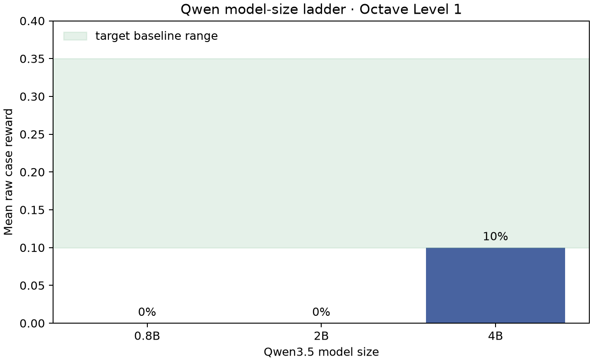
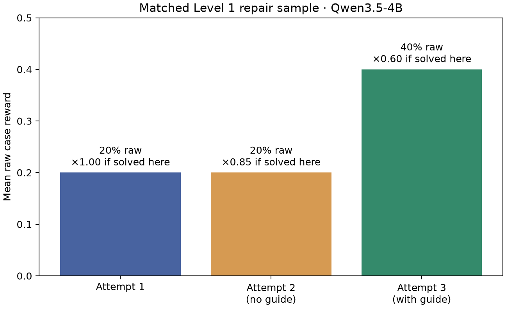
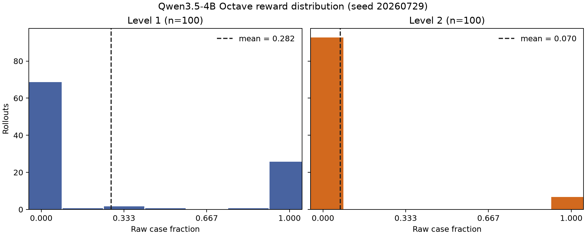

# Octave RL environment: implementation and experiment report

## Executive summary

This project delivers a reproducible GNU Octave code-generation curriculum for
Prime Intellect's native `verifiers.v1` training stack. It contains ten seeded
task families across three difficulty levels, six NumPy-precomputed hidden
cases per task, a pinned GNU Octave 10.2.0 runtime, graduated partial credit,
and a persistent three-attempt debugging interaction.

The intended policy is `Qwen/Qwen3.5-4B`. Smaller tested Qwen3.5 models scored
zero on the Level 1 gate; 4B was the first size in the brief's desired
10–35% one-turn range. A matched ten-task interaction sample showed no lift
from an unguided second response, but a third response with one concise hint
from `Qwen/Qwen3.5-35B-A3B` raised raw correctness from 20% to 40%. To preserve
the incentive to solve early, correctness earned on attempts 1, 2, and 3 is
multiplied by 1.00, 0.85, and 0.60 respectively.

The full generated reference pool passed 9,000/9,000 cases. A separate 200
rollout evaluation had 0% infrastructure errors and a non-degenerate raw
reward distribution: 33 fully correct, 5 partially correct, and 162 zero.

The native prime-rl run completed all 20 optimizer steps with zero rollout
errors. Held-out Level 1 reward rose from 0.010 at startup to 0.905 at step 20;
average held-out turns fell from 3.0 to 1.5. The mean reward of the first five
training steps was 0.050, versus 0.393 for the last five. This is a strong
proof-of-learning result for the easy curriculum, though the ten-task held-out
set remains too small for a precise capability estimate.

## Environment design

Each prompt asks for one named Octave function with an exact signature. The
model returns one fenced function; the environment writes the source to the
matching filename, generates an input-only `run_candidate.m`, and invokes:

```bash
octave --no-gui --quiet run_candidate.m 2>&1
```

The candidate runner contains hidden inputs but never hidden expected outputs
or pass counters. It prints a terminal namespaced transport record containing
each attempted output's shape and flattened numeric values. The trusted Python
task process retains expected values and compares them after parsing that
report, so an untrusted candidate cannot read or overwrite scoring state. This
preserves case-level partial credit even when the candidate raises on some
inputs, without allowing candidate stdout to supply a score.

| Property | Implementation |
| --- | --- |
| Task schema | native typed `verifiers.v1` `Taskset` |
| Requested factory | `load_environment(level, num_tasks, max_turns, require_vectorized, seed, **kwargs)` |
| Interpreter | `ghcr.io/gnu-octave/octave:10.2.0` |
| Observed version | GNU Octave 10.2.0 |
| Verifiers bound | `>=0.2.1,<0.3` |
| Cases per task | 6 |
| Default tasks per level | 500 |
| Sandbox limits | 1 CPU, 2 GB memory, 5 GB disk |
| Correctness reward | fraction of hidden cases passed |
| Execution shaping | none; only hidden-case correctness is rewarded |
| Retry multipliers | 1.00 / 0.85 / 0.60 |

Raw correctness remains available as `raw_case_fraction`, and whole-task success
as `solved`. The optimized reward is correctness times the attempt multiplier:
`1.00`, `0.85`, or `0.60`. There is deliberately no executable-program or
structured-output bonus because candidate code controls its own process output.


Runs recorded before this protocol hardening used an execution bonus. Compare
historical and future model capability only through `raw_case_fraction`, not
shaped training reward.

Since 0.5.0 the reward is **98.9% binary by construction**. Per-case partial
credit -- the last channel through which an answer that is not fully correct can
earn anything -- accounts for 1.08% of reward mass on the parameterised pool
(Qwen3.5-4B, 5,760 rollouts: 1,502 fully correct, 49 partial, 4,209 zero),
against about 6.2% on the 0.4.x pool. A variant that states its convention
precisely is all-or-nothing, so a reader gets it right on all six hidden cases or
wrong on all six. An ablation removing partial credit was designed and then
closed unrun, because the pool change had already done what it was for.

## Curriculum

| Family | Level 1 | Level 2 | Level 3 |
| --- | --- | --- | --- |
| `reduce_along_dim` | column mean | k-th largest | k-th largest, no loops |
| `logical_index` | positive selection | bounded replacement | bounded replacement, no loops |
| `reshape_permute` | column reshape | `[2 1 3]` permutation | `[3 1 2]`, no loops |
| `broadcast_arith` | outer sum | squared pairwise difference | squared difference, no loops |
| `sliding_window` | valid sums | strided means | strided medians, no loops |
| `linsolve_tolerance` | square solve | least squares | solution plus residual |
| `sequence_recurrence` | arithmetic progression | second-order recurrence | vectorized recurrence intent |
| `struct_cell_wrangle` | elementwise row operation | column extrema | column extrema, no loops |
| `string_parse` | comma-separated integers | optional whitespace | finite decimals, no loops |
| `signal_identity` | circular shift | FFT autocorrelation | FFT autocorrelation, no loops |

The generator is deterministic for `(level, seed, task index)`. Expected
values are calculated by NumPy before rollout and retained by the trusted task
process; reference code is never included in model-visible task data or the
candidate sandbox.

This first RL run trained only on Level 1. It did not mix levels: the measured
7% Level 2 and 0% Level 3 baselines are too sparse for an efficient initial
GRPO curriculum. The 0.905 final held-out Level 1 result clears the promotion
gate. A follow-on phase should first confirm it on a larger held-out set, then
train on 80–90% Level 1 and 10–20% Level 2. Level 3 should remain excluded
until Level 2 itself supplies reliable, nonzero held-out reward.

## Calibration



| Model and condition | Level | n | Raw mean | Fully solved |
| --- | ---: | ---: | ---: | ---: |
| Qwen3.5-0.8B, one turn | 1 | 10 | 0% | 0 |
| Qwen3.5-2B, one turn | 1 | 10 | 0% | 0 |
| Qwen3.5-4B, one turn | 1 | 10 | 10% | 1 |
| Qwen3.5-4B, one turn | 2 | 10 | 10% | 1 |
| Qwen3.5-4B, one turn | 3 | 10 | 0% | 0 |

These are small stochastic gates, not confidence-bounded model comparisons.
Their purpose was to avoid spending a training run on a policy with either no
signal or a saturated baseline. The 4B model was the first tested size to
cross the gate, so no larger policy was needed.



On the matched Level 1 sample, the unguided retry did not repair an additional
task. The guide is introduced only after two failures and receives the prompt,
candidate, and first useful diagnostic line. Its system instruction requires
one concise issue-identifying hint and forbids replacement code or a complete
solution. Two additional tasks were repaired on attempt 3.

## Distribution, reference, and anti-hack validation



| Pool | Valid rollouts | Raw mean | Full | Partial | Zero | Infra errors |
| --- | ---: | ---: | ---: | ---: | ---: | ---: |
| Level 1 | 100 | 28.17% | 26 | 5 | 69 | 0 |
| Level 2 | 100 | 7.00% | 7 | 0 | 93 | 0 |
| Combined | 200 | 17.58% | 33 | 5 | 162 | 0 |

The complete 1,500-task pool—500 tasks at each level—was checked by running
every reference implementation in the pinned Prime Sandbox image. All
9,000/9,000 hidden cases passed. An exact-output audit also found 0/500 tasks
at every level for which one constant value matched all six expected outputs.

Machine-readable evidence:

- `artifacts/reference_validation.json`
- `artifacts/reward_distribution.json`
- `artifacts/calibration_summary.json`
- `artifacts/constant_output_audit.json`

## Native RL experiment

The run uses the native `verifiers.v1` taskset/harness contract throughout.
Prime Hosted Training supports both that contract and the alternative legacy
v0 `Environment` contract; this project does not use the v0 form. We ran
open-source prime-rl on a Prime GPU pod to retain direct control over the
pinned prime-rl/verifiers revisions, v1 user simulator, CUDA backend,
diagnostics, logs, and checkpoint retrieval. The source revision is
`44539229436a23e624b0f39826014a4e58a703be`, with its verifiers submodule at
`ab65b6e83576141e71fdc9f02e0af94cc3258455` (`verifiers==0.2.1`).

| Setting | Value |
| --- | --- |
| Policy | `Qwen/Qwen3.5-4B` |
| Hardware | 2× RTX 6000 Ada 48 GB |
| Topology | 1 trainer GPU + 1 inference GPU |
| Compute duration | 2.6 h valid pod + 4 min failed spot pod |
| Estimated compute cost | approximately $4.00 |
| Algorithm | GRPO |
| Train pool | Level 1, 500 tasks, seed 314159 |
| Group / batch size | 8 / 8 |
| Adapter | LoRA rank 16, alpha 32 |
| Learning rate | `1e-5` |
| Completion cap | 1,024 tokens |
| Interaction | maximum 3 attempts with guide before attempt 3 |
| Held-out eval | 10 tasks, seed 271828, startup and every 5 steps |
| Planned maximum | 20 optimizer steps |
| Required evidence threshold | at least 10 valid steps and a non-flat reward curve |


| Result | Observed |
| --- | ---: |
| Completed optimizer steps | 20 / 20 |
| Valid training rollouts | 160 / 160 |
| Rollout infrastructure errors | 0 |
| Mean train reward, steps 1–5 | 0.050 |
| Mean train reward, steps 16–20 | 0.393 |
| Maximum train reward | 0.788 (step 13) |
| Held-out reward, startup | 0.010 |
| Held-out reward, step 15 | 0.380 |
| Held-out reward, step 20 | 0.905 |
| Held-out turns, startup → step 20 | 3.0 → 1.5 |
| Held-out truncation, startup → step 20 | 100% → 20% |
| Mismatch KL range | 0.0004–0.0005 |

The held-out trace was initially noisy: 0.010, 0.070, and 0.010 at startup,
step 5, and step 10, before rising to 0.380 and 0.905. This is why promotion
was withheld during the first half of the run. The final improvement is large
and coincides with earlier successful termination, but it is measured on only
ten deterministic held-out tasks. The next experiment should evaluate more
examples before and after introducing a minority of Level 2 tasks.

Periodic evaluation was intentionally frequent for this short validation run
so overfitting and curriculum readiness could be observed. It was expensive:
full held-out passes took roughly 8–13 minutes. A longer run should evaluate
every 10–20 steps and at the end, rather than every five steps.

Prime history reports 2.6 hours for the valid RTX 6000 Ada pod at $1.50/hour
and four minutes for the failed spot A100 pod at approximately $1.253/hour.
The resulting compute estimate is about $3.98; Prime's eventual account ledger
is authoritative if provider rounding differs.

## Staged curriculum follow-on

A July 30 follow-on exercised the automatic level-shift controller against
distinct statically merged Qwen checkpoints. The controller evaluated 24
held-out Level 1 tasks at global steps 10 and 15. Both checkpoints scored
0.75 raw case fraction with zero infrastructure errors; their one-sided 95%
Wilson lower bounds were 0.5845, above the 0.55 promotion threshold. Because
these were two consecutive checkpoint observations, the controller moved from
`level1_only` to `introduce_level2` at exactly step 15 and changed the training
mix from 100/0/0 to 80/20/0.

| Checkpoint | Held-out L1 n | Raw | First-attempt | Mean attempts | Truncation |
| ---: | ---: | ---: | ---: | ---: | ---: |
| 10 | 24 | 0.75 | 0.542 | 1.792 | 0.292 |
| 15 | 24 | 0.75 | 0.542 | 1.833 | 0.208 |


The visualization combines effective GRPO training traces with the two
checkpoint-static held-out sets. It shows raw correctness, end-to-end return
latency, retry count, and token truncation on a common global-step axis. The
machine-readable companion is
`artifacts/curriculum/live-2026-07-30/rollout-dynamics.csv`.

The post-transition path then completed two additional optimizer steps at
global steps 16 and 17 using an eight-rollout batch, two-rollout GRPO groups,
and a two-request inference cap. This smaller concurrency avoided the Qwen
GDN/vLLM CUDA failure reproduced at seven to eight simultaneous requests.
Step 16 contained effective Level 1 and Level 2 rollouts; step 17 contained
Level 1 rollouts. These training samples are not held-out capability estimates.

| Global step | Trainer time | Effective L1 | Effective L2 | Loss | Mismatch KL |
| ---: | ---: | ---: | ---: | ---: | ---: |
| 16 | 15m 29s | 2, raw 0.000 | 4, raw 0.750 | 0.0016 | 0.0359 |
| 17 | 15m 08s | 6, raw 0.333 | none | 0.0078 | 0.0413 |

During collection for the next optimizer batch, Prime Sandbox began rejecting
provisioning with `Payment required`. The budget deadline stopped the process;
324 of 326 partial step-18 rows carried infrastructure errors, so step 18 is
excluded from the chart and every capability claim. No post-transition
held-out score was attempted because it uses the same unavailable Sandbox
service. A `STABLE` step-2 LoRA broadcast was retrieved and hash-verified, but
its required staged step-15 merged base was not copied off the ephemeral pod.
The adapter is therefore retained as training evidence, not as a locally
deployable checkpoint, and must not be applied directly to the original
step-20 base. The conservative controller state remains at step 15 because no
full trainer checkpoint was written.

The RTX 6000 Ada pod was active for approximately 9.18 hours at $1.50/hour,
or about $13.77, below the $20 compute ceiling, and was terminated after
artifact retrieval. Prime reported zero active pods afterward. Exact evidence,
failed-attempt logs, durable state, the adapter, and a machine-readable summary
are under `artifacts/curriculum/live-2026-07-30/`.

## What differed from the reasoned execution plan in §6

1. The official `ghcr.io/gnu-octave/octave:10.2.0` image was used instead of
   building Debian Bookworm plus `apt install octave`. It gives an explicit
   immutable language-version tag and produced GNU Octave 10.2.0.
2. Passing reference runs exited 0 and deliberately failing runs exited 1.
   Correctness still uses the machine-readable result because an uncaught
   interpreter failure alone is not a partial-credit signal.
3. Per-case errors are catchable with `try/catch`; the harness can continue
   through all six cases and report a fraction.
4. Candidate diagnostics can appear on either stream. Running with `2>&1` and
   combining stdout/stderr preserved useful retry feedback.
5. Writing `.m` files avoided nested shell quoting entirely. The only shell
   command is the fixed Octave invocation.
6. Octave startup was comfortably inside the 60-second command timeout.
   End-to-end rollout latency was instead dominated by up to three language
   model generations and Prime Sandbox provisioning.
7. Current Prime Sandbox SDK methods are byte upload plus command execution,
   rather than the exact per-file helper name assumed by the brief. Two small
   files per task did not justify a tar archive.
8. Empty JSON lists needed explicit `zeros(1, 0)`: Octave's `[]` is 0×0, while
   logical indexing of a row can correctly produce 1×0.
9. FFT reference outputs differed by a few ulps across kernels. Quantizing
   NumPy expectations to 12 decimal places remained far inside the task's
   `1e-7` tolerance and made generation byte-stable.

## Limitations

- Calibration samples contain only ten tasks per condition; the 200-rollout
  distribution is the stronger difficulty estimate.
- The guide experiment demonstrates repair lift, not that the hint itself
  caused every repair. A larger matched ablation is needed for causal claims.
- Held-out evaluation contains ten tasks. The final 0.905 is compelling
  directional evidence, not a confidence-bounded benchmark.
- The step-5 evaluator reported a mixture of adjacent policy versions while
  rollouts were interleaved. Treat that point as diagnostic only; the terminal
  step-20 evaluation used policy v19 and is the primary result.
- Level 3 is intentionally a stretch pool and produced no solved task in its
  ten-example gate.
- The no-loop check is lexical and is exposed as a metric; it is not part of
  optimized correctness reward in this first run.
- The package is ready for the Environments Hub but has not been pushed because
  public versus private visibility is a user-controlled publication choice.

## Reproduction

```bash
uv run --project environments/octave_rl --with pytest pytest -q
uv run python scripts/audit_constant_outputs.py
uv run python scripts/validate_reference_pool.py
uv run --with matplotlib python scripts/plot_calibration.py
uv run --with matplotlib python scripts/plot_reward_distribution.py \
  outputs/distribution/qwen-4b-level1/traces.jsonl \
  outputs/distribution/qwen-4b-level2/traces.jsonl
uv run --with matplotlib python scripts/plot_training_curve.py \
  artifacts/training/octave-qwen-4b-20step/logs/orchestrator.log \
  artifacts/training/octave-qwen-4b-20step/logs/trainer.log
```

See `TRAINING_RUNBOOK.md` for the pinned native prime-rl launch procedure and
stop conditions.

## Appendix A: issues encountered

| Issue | Boundary | Resolution / disposition |
| --- | --- | --- |
| `max_turns` was nested in the wrong eval config scope | configuration | moved to the environment rollout specification |
| Qwen3.5 rejected an unsupported thinking toggle | inference request | used `reasoning_effort="none"` |
| Linear-solve expectations lost column orientation | task generation | serialized expected solutions explicitly as columns |
| FFT values varied by a few ulps | numerical reference | rounded at 12 decimals inside `1e-7` tolerance |
| Empty row results became 0×0 | harness serialization | render empty lists as `zeros(1, 0)` |
| Local Prime account had no registered SSH key | compute access | registered the existing local RSA public key; no private material was uploaded |
| First A100 spot pod was inaccessible | provider/access | terminated promptly; replaced with an available 2× RTX 6000 Ada pod |
| Public prime-rl submodules used SSH GitHub URLs | source setup | rewrote public submodule URLs to HTTPS |
| A nested submodule worktree was initially empty | source setup | forced checkout of the pinned submodule revision |
| vLLM CUDA graph initialization hit an illegal instruction on SM89 | inference runtime | enabled eager execution |
| vLLM bundled FlashAttention-2 hit a misaligned CUDA address | inference runtime | selected `TRITON_ATTN` through the supported vLLM-extra config |
| `VLLM_ATTENTION_BACKEND` was ignored by this prime-rl launcher | configuration | used `[inference.vllm_extra] attention_backend` |
| Current prime-rl main used a newer interleaving-agent API | version boundary | pinned the compatible prime-rl and verifiers revisions above |
| Root system Python had mismatched protobuf packages | local testing | used the repository's bounded `uv run --with pytest pytest -q` environment rather than treating host-package failure as an environment result |
| Step-5 evaluation interleaved adjacent policy versions | evaluation interpretation | retained the point as a noisy diagnostic and used the terminal policy-v19 result as primary evidence |
| Full trainer state was 19 GB and duplicated model tensors | artifact retrieval | retained the complete 8.6 GB deployable model, LoRA adapter, configs, logs, and every rollout; omitted the redundant optimizer-state archive |

Failed launch attempts are retained separately from valid rollout evidence.
Provider, CUDA, and configuration failures are never counted as zero-reward
model samples.

## Appendix B: artifact provenance

The raw directories listed below describe the complete local experiment
archive. The public Git repository excludes weights, checkpoints, logs, and
raw traces (which can reveal hidden cases); it retains the aggregate JSON,
CSV, and PNG evidence plus all reproduction code and configs.

| Artifact | Source |
| --- | --- |
| `outputs/calibration/` | Prime eval traces for size, level, and retry gates |
| `outputs/distribution/` | 200 valid one-turn Prime eval traces |
| `artifacts/reward_distribution.*` | error-aware distribution parser and plot |
| `artifacts/reference_validation.json` | pinned-runtime execution of all references |
| `artifacts/constant_output_audit.json` | exact expected-output collision scan |
| `artifacts/training/` | native prime-rl configs, logs, every rollout, failed-attempt diagnostics, and final deployable weights |
| `artifacts/training_summary.json` | parsed train, held-out, loss, entropy, KL, and gradient metrics |
| `artifacts/training_curve.png` | reproducible native training and held-out curve |
| `artifacts/curriculum/live-2026-07-30/` | staged transition state, static held-out traces, post-transition effective rollouts, failure logs, hash-verified step-2 adapter, timing CSV/plot, and summary |
